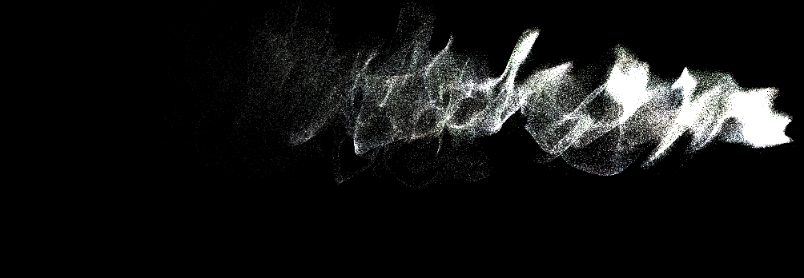

About
=====

We are currently taking the course Computer Graphics and Interaction
at KTH.  Creating a computer graphics related project is one of the
main goals of the course. This blog will follow our progress in that
project. The members of the project group are Joakim Lilja, Gustav Nelson Schneider and
Timmy Nielsen.

(stage 4) More Features
=======================

Since the previous stage, we have managed to implement some extra
features such as user control of the particle system gravity, gamma
correction, and exposure. We also give the user information about the
position where the particle system currently emits particles.

Because of our preparations in structuring the code well from the
beginning, the features are pretty trivial to implement. What has
taken more time is optimizing the features and making the effects look
as good and smooth as possible.

**Structuring**

We also spent some time re-structuring parts of the code for better
functionality and readability. We moved some of the code in our
previous main-method into appropriate class representations instead,
meaning the actual particle system is now a class in its own, etc.

**Bloom**

With Gaussian blur implemented we could now implement a bloom
effect. We found a chapter in Nvidia's GPU gems linked below which
describes the effect and how works. We chose to implement the effect
which was quite easy with our already finished gaussian blur. See the
image below for the bloom effect. Below you can see a render with a
little over one million particles, running on one of the team members
laptops.

[Link to GPU gems article](http://developer.download.nvidia.com/books/HTML/gpugems/gpugems_ch21.html)

**Next stage**

Now we will basically just focus on fine-tuning the code, making sure
the system works smoothly on the Linux and Windows platform, and
finishing the project report.

(stage 3) Gaussian Blur
=======================
	
We knew that we needed some blur filter to enable us to create a bloom
effect later on in the project. This led us to implement a Gaussian
blur filter that is activated through the user toggling a blur
checkbox on the canvas. We started implementing a box blur since that
algorithm was trivial and we wanted to test a blur effect out. After a
while of researching different blur effects, we ended up using gaussian
blur because we felt it looked best out of the options we
examined. The filter was implemented using a single compute shader
which is run two times on the texture created by the initial
render. The 2-dimensional Gaussian blur is a separable function, a
huge optimization is, therefore, to do the gaussian blur in two steps,
one horizontal and one vertical.

The implementation of gaussian blur was problematic - not because of
the complexity of the algorithm (it actually wasn’t that hard) but
because of some basic bugs occurring throughout the implementation
that was hard to find but easy to fix. The most frustrating bug took
us a couple of hours to fix, and it wasn’t until after eating lunch
and looking at the code with a full stomach that we realized we had
mistakenly put the z-coordinate to 0 instead of its correct value 1.

**Time control**

Just as we implemented the blur parameter checkbox to switch blur
on/off, we have created a similar parameter to pausing time in the
particle system. Pausing works great for now, but the back-end time
count is not stopped during the pause, meaning that unpausing makes
the particle system jump ahead to a frame based on the time spent
paused. We will make sure this is rectified in the next stage update.

**Next stage**

The project is nearing completion, and what’s left is mostly refining
and cleaning up the code. We are, however, still discussing what
possible features and improvements we can introduce before the project
deadline. We might be able to implement a slow/fast-motion alternative
for the particle system etc. although we will have to keep a close eye
on the project deadline and not get over our heads with ambition.

(stage 2) Compute Shaders
========================

In the previous blog post, we mentioned that we implemented the
transform feedback functionality to increase performance and not
having the data to be sent from the CPU all the time. We successfully
implemented this but noticed that it was more tedious to work with
than seemed necessary. We did some research on the topic and found
that you can implement the same functionality without using the
rasterization pipeline by incorporating compute shaders in our system.

Compute shaders looked promising and we successfully implemented it in
our project. It was no real issue to change from transform feedback to
compute shaders and after the implementation changes were in place the
small particle system we had built was functioning equally as good, if
not better, as the previous solution. Compute shaders does the same
job as transform feedback by updating the data (the particles, in our
case) and saving it back to the GPU memory buffer.

**Curl noise**

Next up we have further developed our noise and decided to implemented
curl noise. We found a paper that describes how to implement curl
noise, which is based on Perlin noise. The technique is based on
calculating the curl of a 3d-dimensional noise vector field. We
created the vector field by using a single 3d noise function, which we
offset by a large value for each axis.

The noise as described in the paper would give some nice animated
turbulent fluid movement which it indeed did. Below you can find a
link to the paper and also an image of our current state of the
particle system together with the noise implementation. To see
everything in action we made the particles follow a sine curve, to
better see how the noise affect the system.

[Link to the curl-noise paper](https://www.cs.ubc.ca/~rbridson/docs/bridson-siggraph2007-curlnoise.pdf)

**Next stage**
For the next stage of our project, we plan to start introducing more user interactive features. At this moment we expect to at least implement a blur effect controlled by the user, but we are still discussing and researching other kinds of user interactive features we might want to include.

(stage 1) Transform Feedback
===========================
We followed our initial idea that we mentioned in the previous blog
post about starting off with transform feedback. Transform feedback
lets us update the data in GPU memory directly on the GPU instead of
sending it back and forth between the CPU and the GPU. Transform Feedback
makes this possible by letting us output data to an OpenGL buffer in
the vertex shader or the geometry shader stage. Sending memory from
the CPU to the GPU is really slow, sending millions of particles to
the GPU every frame would overflow our memory bus, keeping the data on
the GPU is therefore really important to enable us to render a lot of
particles.

The Transform feedback functionality was not that hard to implement as
it sort of is a part of the rasterization pipeline. Although it
required quite a few steps to set up. We managed to implement the
transform feedback quite fast (quite a few hours) without any major
struggles. Note that transform feedback only works if you have created
a buffer on the GPU memory and actually sent the data to that buffer
to let the transform feedback update the data.

**The particle system**

We also decided to start spawning some particles to actually start
with the project and test our transform feedback solution. We created
a shader program to receive the data, manipulate it and set a color
for it. It worked fine and the transform feedback implementation
seemed to work as well. We could easily run the program with 1000000
particles.

**Next stage**

Next up in the project that we have discussed is to implement some
noise function to add to our particle shader program and to the
particle system as a whole and as a feature for the project. We have
not decided yet what noise function to use and implement but we will
do some research about different alternatives.

(stage 0) Setup and initial project specification
=======================================

We decided early on that we wanted to do a project related to rendering. After some discussion, we managed to narrow it down to either
realistic water rendering or similar GPU particle systems. We have not yet
started working on the project specifics, but at the moment it's
leaning towards creating a GPU particle system.

**Setup**

Since our group consists of both Windows and Linux users, we first wanted
to create a project which is possible to build in both environments.
Gustav is the only member of the group who prefers working in Linux,
and as he has the most experience with build systems he gladly
took on creating a skeleton project which we could use as a starting point.
We needed a build system that was easy to use for Windows users as well as
being compatible with Linux, making CMake a reasonable choice.

We decided to use OpenGL as DirectX isn't cross-compatible and Vulkan
would be too complicated. Furthermore, OpenGL was the only API that we
had prior experience using. Next, we needed some cross-platform libraries
for creating our OpenGL context and loading OpenGL symbols. The libraries
we eventually decided on was GLFW (for creating the context) and GLEW 
(for symbol loading). We also decided to use GLM for the mathematical
calculations. We will probably want to add some sliders and such to
change the parameters in the demo we plan on making - we therefore
also include ImGUI as a dependency, which is easy to use and
will probably help us with everything we need in the future.

We have also made smart pointer wrappers for some
commonly used OpenGL objects. This might not be the most optimal
solution, but at least it gives us some form of memory management
(which to be honest probably isn't necessary for this project).

As of writing this, we will probably start working on the underlying architecture of the engine. We will also try to make the underlying structure of the engine general enough to be used for other stuff than just rendering particle systems. This is more of an intellectual challenge for us and a chance to test out ideas rather than an actual necessity. Gustav is currently reworking the architecture of another engine with the purpose of being used in 64k Intro, and hopefully, we can implement some of the ideas from this project into that. One reason why we might want a more general purpose engine is to be able to see how the particle system interacts with other 3D objects in a scene. And if we need a 3D-engine we might as well try and do a decent job. The code would also be more reusable if we want to include it in a future project.

**GPU particle systems**

There are multiple ways we could create a particle system and we have
not really decided exactly what approach we will use at the
moment. One quite straight forward approach would be to use transform
feedback. Our first proof of concept will probably use this
approach. On the other hand, we could probably achieve the same thing
storing the data in some kind of textures or utilizing compute
shaders.
